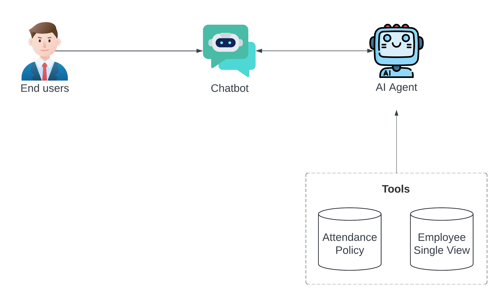

# MADT8102 Final Project

[](https://employee-attendance-ai-chatbot.streamlit.app/)

This repository contains the **AI Chatbot for Employee Attendance Assistance**, a tool developed for HR analytics. This project serves as the final assignment for the **MADT8102** course.

## Project Overview



The AI Chatbot is designed to support HR teams in monitoring and analyzing employee attendance patterns and predicting potential attrition. It integrates two primary tools:

1. **Attendance Policy Retrieval Tool**: Allows HR to quickly retrieve company attendance policies using natural language queries. This tool leverages a vector database to ensure relevant sections of the policy are easily accessible for various questions, such as "What is the remote work policy?" or "How many days can employees work from home?"

2. **Employee Single View Analysis Tool**: Provides a consolidated view of employee attendance data and uses machine learning to predict attrition risk within the next three months. This tool responds to queries like "Which employees are at risk of resigning?" and "How often did employee ID 1 work on-site?" by analyzing attendance patterns and calculating attrition scores. It offers insights directly, minimizing the need for manual analysis by HR staff.

Together, these tools empower HR professionals with quick access to attendance policies and predictive analytics on employee behavior, helping to support proactive workforce management.

## Installation

To install this project, ensure that Python 3 is installed on your system. Additionally, you will need an OpenAI API key. If you do not have one, you can obtain it [here](https://platform.openai.com/account/api-keys).

Next, install the required dependencies by running the following command:

```bash
pip install -r requirements.txt
```

## Usage

To run this project, navigate to the root project directory and execute the following command:

```bash
streamlit run modeling/app.py
```

Your Streamlit app should open in your browser. If you encounter an SQLite error, please refer to the solution in the [Chroma SQLite troubleshooting guide](https://docs.trychroma.com/troubleshooting#sqlite).